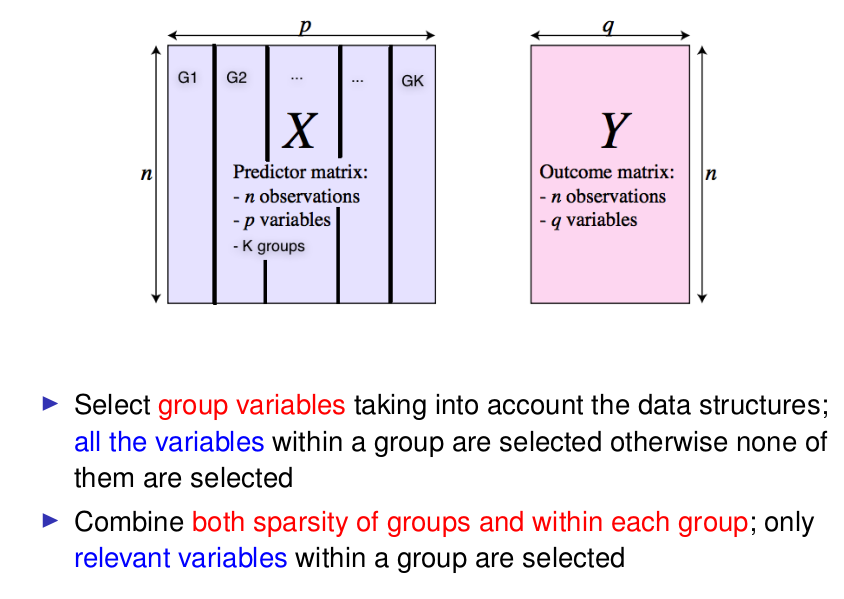
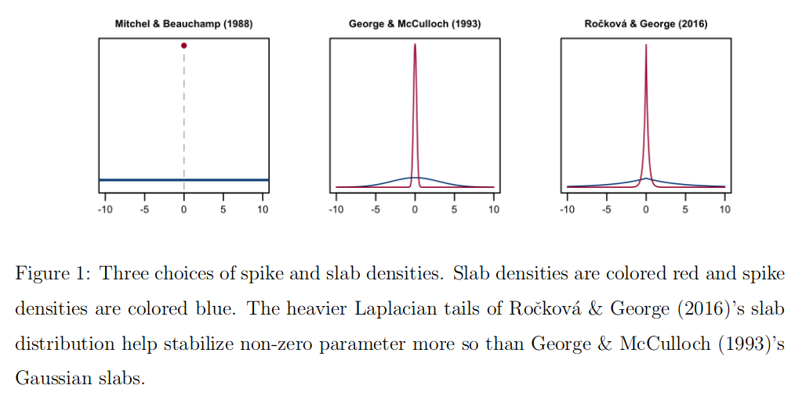

## Application Rat Data: Aim and Data 

 

## Goals 

- dentify a parsimonious set of predictors} that explains the _joint variability of gene expression_ in four tissues (adrenal gland, fat, heart, and kidney).

- 770 SNPs in 29 inbred rats as a predictor matrix (n = 29, p = 770)

- 29 measured expression levels in the 4 tissues as the outcome (q = 4).

```{r}
load("RAT.RData")
X <- RAT$X
Y <- RAT$Y
MAP.file <- RAT$MAP.file
gsize <- RAT$gsize
dim(X)
dim(Y)
```

## Solution 

- Any idea ?

- Spike and Slab prior: "The Spike-and-Slab LASSO" (https://amstat.tandfonline.com/doi/abs/10.1080/01621459.2016.1260469#.XdtSu9HjI5k) : R package SSLASSO.

 


- Univariate model using "BhGLM: Bayesian hierarchical GLMs"(https://github.com/nyiuab/BhGLM).  

```{r}
devtools::install_github("nyiuab/BhGLM", build_opts = c("--no-resave-data", "--no-manual"), force = T)
```

- Using the "Spike-and-Slab Group Lassos for Grouped Regression"(https://github.com/jantonelli111/SSGL)

```{r}
library(devtools)
install_github(repo = "jantonelli111/SSGL")
library(SSGL)
```

- Reproduce results from the paper "[Bayesian Variable Selection Regression of
Multivariate Responses for Group Data](BA.pdf)"  using the R package MBSGS

```{r}
library(MBSGS)
```
