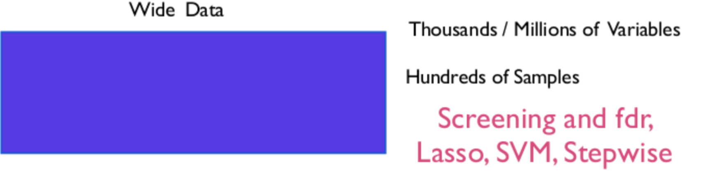
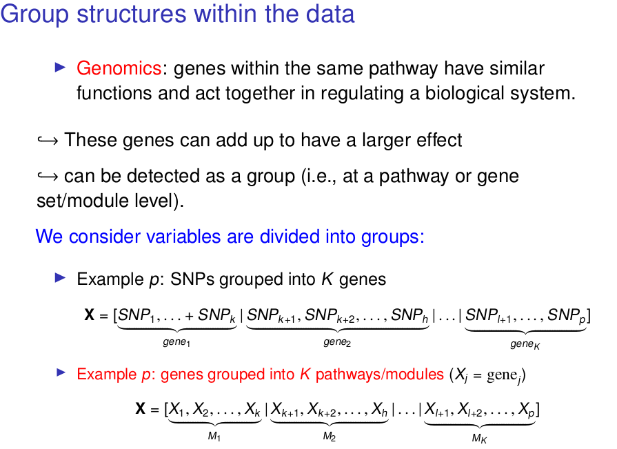

Bayes on the Beach Workshop 2019
================================

Workshop Aims:
--------------

-   Explore Bayesian Variable Selection methods for group structure data
-   Some coding in R 
-   Analysis of two Genetics Data Set

## Genomics Data: Wide Data, High Dimensional Data

 

We have too many variables, prone to overfitting.
Need to remove variable, or regularize, or both 

- Main constraint: situation with p>n

- Strong colinearity among the variables.


 


## Application Rat Data: Aim and Data 

 

- [Rat Data](Rat-application.pdf)

## Goals 

- dentify a parsimonious set of predictors} that explains the \textcolor{blue}{joint variability of gene expression} in four tissues (adrenal gland, fat, heart, and kidney).

- 770 SNPs in 29 inbred rats as a predictor matrix (n = 29, p = 770)
- 29 measured expression levels in the 4 tissues as the outcome (q = 4).

```{r}
load("RAT.RData")
X <- RAT$X
Y <- RAT$Y
MAP.file <- RAT$MAP.file
gsize <- RAT$gsize
dim(X)
dim(Y)
```

